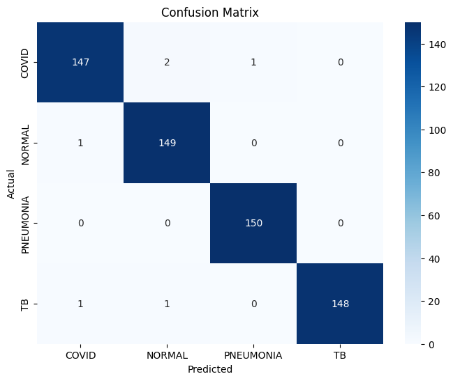
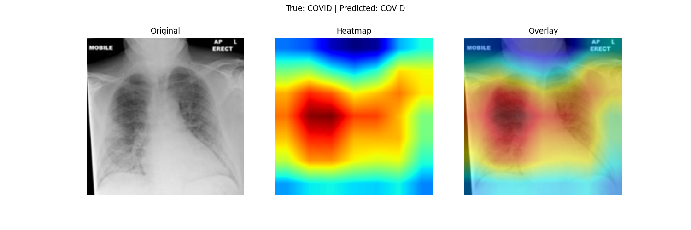
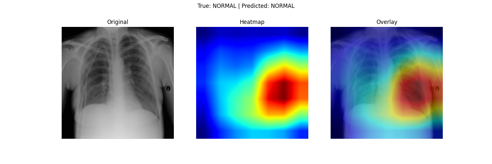
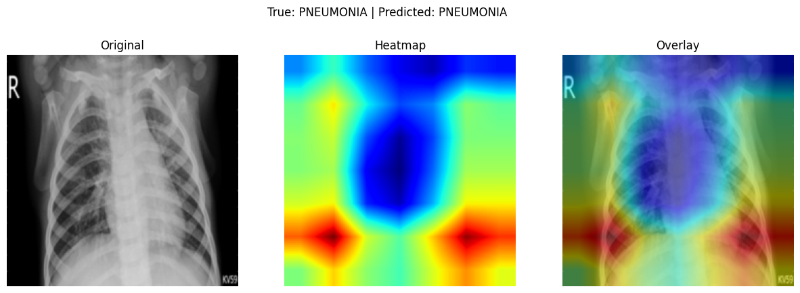
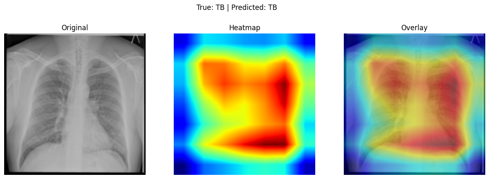
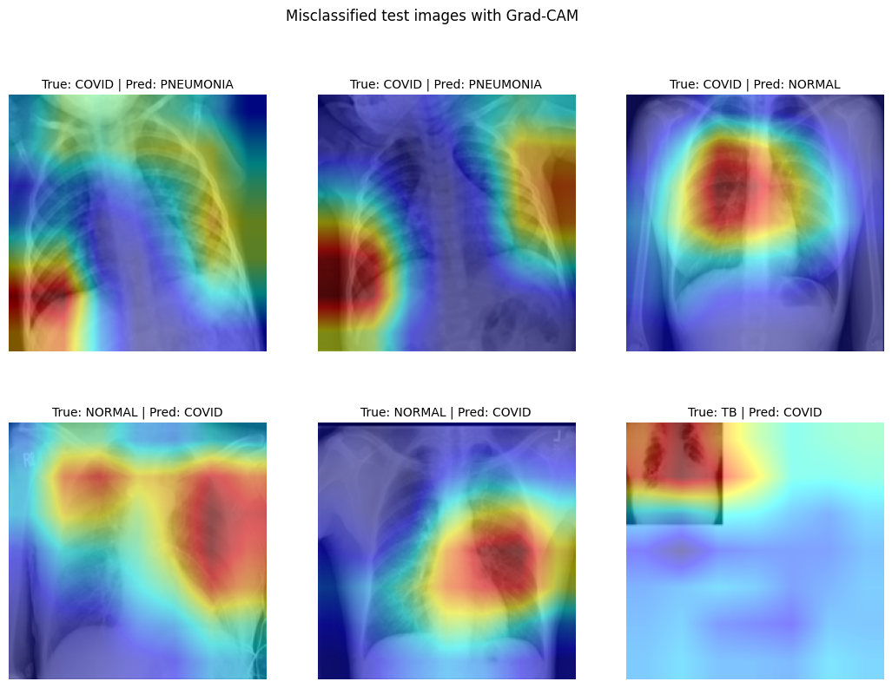

# Chest X-Ray Classification with Grad-CAM

A CNN-based classifier for chest X-rays, distinguishing between COVID-19, Normal, Pneumonia, and Tuberculosis, with Grad-CAM visualizations showing where the model focuses when making each prediction.

## Overview

This project uses transfer learning with a pretrained ResNet18 to classify chest X-ray images into four categories. Given that medical imaging datasets are often limited in size, transfer learning was chosen over training from scratch to make better use of the available 2,000 training images.

Beyond classification, the project implements Grad-CAM (Gradient-weighted Class Activation Mapping) to visualize which regions of an X-ray the model relies on for its predictions — an important step toward making the model's decisions interpretable rather than a black box.

## Dataset

## Dataset

A four-class chest X-ray collection (COVID-19, Normal, Pneumonia, Tuberculosis) that appears to be compiled from several public sources. The exact sources and licences are being confirmed, and this section will be updated with citations.

- Classes: COVID-19, Normal, Pneumonia, Tuberculosis
- Training set: 2,000 images (500 per class). 15% of them (300 images, stratified by class) are held out as a validation set, so 1,700 are used for fitting.
- Test set: 600 images (150 per class), used once at the end.
- Image size is 299 x 299 for COVID-19 and Pneumonia and 512 x 512 for Normal and TB, and the classes differ clearly in how the images look (see Limitations).

Note: the same images are also used in an ongoing M.Eng. research project comparing radiomics and foundation model performance across datasets and modalities. This repository is a distinct piece of work, a CNN classification and explainability pipeline, built independently of that research.

## Architecture


## Results

The model was trained for 10 epochs, with the best checkpoint (by test accuracy) saved during training.

**Best model performance (test set, 600 images):**

| Class     | Precision | Recall | F1-score |
|-----------|-----------|--------|----------|
| COVID     | 0.99      | 0.98   | 0.98     |
| Normal    | 0.98      | 0.99   | 0.99     |
| Pneumonia | 0.99      | 1.00   | 1.00     |
| TB        | 1.00      | 0.99   | 0.99     |

**Overall accuracy: 99%**



## Grad-CAM Visualizations

Grad-CAM shows which parts of the image the model relied on for a prediction. The maps are coarse (about 7 x 7 cells stretched over the image), so they show where the model looked, not where disease is.






For the COVID, Normal and TB examples, the strongest activation falls mostly inside the chest. For the Pneumonia example, it concentrates in the lower corners and along the sides, partly outside the lungs, so this example does not show the model looking at lung tissue. One example per class is not enough to conclude whether the model uses image borders or markers.

### Misclassified cases



Six of the 13 test errors are shown (every second one). All six involve the COVID class. Two COVID images predicted as Pneumonia appear tightly cropped, with heat at the image edge. One TB image predicted as COVID is a small X-ray on a mostly blank canvas, which looks like a data problem. The maps do not show a single clear cause for the errors.

## Installation

```bash
pip install -r requirements.txt
```

## Running tests

```bash
pytest tests/
```

## Limitations

- **Class-linked image differences (shortcut risk).** The classes appear to come from different sources. Image size depends on the class (299 x 299 for COVID-19 and Pneumonia, 512 x 512 for Normal and TB). In a random sample of eight images per class, the Pneumonia images look like children's X-rays with a large "R" marker and timestamps, six of the eight TB images have white rectangles over part of the image, and several COVID-19 images carry text labels. A logistic regression using only image size, brightness, contrast and the share of black and white pixels reaches 81% cross-validated accuracy on the training set (chance is 25%). The CNN may therefore use these cues instead of, or alongside, disease. The 97.8% test accuracy comes from the same sources, so it does not show how the model would perform on X-rays from a new hospital or scanner, and it should not be read as evidence that the model detects disease.
- **One run, one split.** The 97.8% test accuracy comes from a single training run and a single split. With 600 test images, the 95% confidence interval is roughly 96.3% to 98.7%, so small differences between runs are not meaningful. The model was trained on only 2,000 images and was not tested on any outside data.
- **COVID is the weakest class** (recall 0.96).
- **Grad-CAM is qualitative and coarse.** It shows where the model looked, not where disease is. For the same X-ray, two training runs with similar accuracy highlighted different lungs, and in the Pneumonia example the heat was mostly at the image edges.
- **Overfitting.** Training accuracy reaches nearly 100% within a few epochs. The best epoch is chosen on a held-out validation set, and the test set is used only once, at the end.

This project is for education and research only. It is not designed for clinical diagnosis or deployment in a clinical setting.

- **Image style.** The example images differ in framing, borders and markers, and some are unusual (for example a small X-ray on a mostly blank canvas). Whether the model uses image-style cues, instead of or alongside the lungs, was not ruled out.

This project is intended for educational and research purposes only and is not designed for clinical diagnosis or deployment in a clinical setting.

## License

MIT
